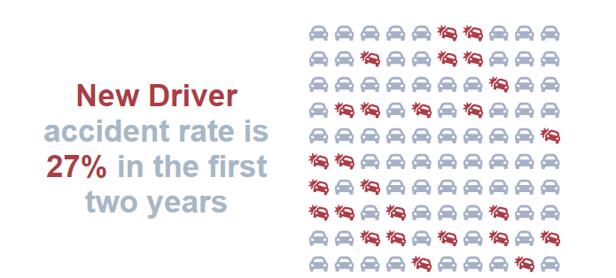

# Qlik Sense KPI Grid Chart with SVG Icons
---
### Introduction:
A Qlik Sense kpi object that generates a Grid / Waffle chart with SVG icons based on the 2 Measures
KPI Styles HTML message

---
### Status:
This project is **work in progress**. 

Future features please raise an issue here for consideration or create a pull request

---
### Comments, Feedback & Questions:
if you have any questions, found error, etc, please create an issue or Pull request.

---
### Author:
Richard Pearce
- [GitHub](https://github.com/RichardPearce60)
- [LinkedIn](https://www.linkedin.com/in/richard-pearce-19ab6041/)
- [QlikCentral.com](http://www.qlikcentral.com)

---
### Dimensions:
No Dimensions are allowed

---
### Measures:
Two measures are required:

1. Numerator (Active)
2. Denominator (Remainder are Inactive)

---
### KPI Message:

Example: 
`='
New Driver accident rate is '& $(=num(sum([Field A])/sum([Field B])*100,'0.')) &'% in the first two years
'`

- KPI message is a string with p tags, class 'inactive' within
- Use span class 'active' to highlight the text as required
- $() Dollar expansion can be inserted to calculate Qlik Expressions
- Further Styling can be done in the CSS file available via the DevHub

---
### Appearance / Icon
- Chose SVG Icons from drop down list
- Choose colors for both active and inactive Icons, these will also be used in the KPI Message
- You can choose inline or random distribution for active icons. Randon will recalculate on every refresh
- The number of icons displayed is the minimum value of:
    - Maximum Number of Icons (properties)
    - Capactity of the space availible and the size / margin of the icons
    - Denominator

---
### Installation Instructions:
- Download the zip file of this directory and deploy to your Sense environment.
- [Qlik Sense Extension Deployment Steps](https://help.qlik.com/en-US/sense-developer/August2022/Subsystems/Extensions/Content/Sense_Extensions/Howtos/deploy-extensions.htm)

---
### Licence
Copyright © 2022 Richard Pearce

Permission is hereby granted, free of charge, to any person obtaining a copy of this software and associated documentation files (the "Software"), to deal in the Software without restriction, including without limitation the rights to use, copy, modify, merge, publish, distribute, sublicense, and/or sell copies of the Software, and to permit persons to whom the Software is furnished to do so, subject to the following conditions:

The above copyright notice and this permission notice shall be included in all copies or substantial portions of the Software.

THE SOFTWARE IS PROVIDED "AS IS", WITHOUT WARRANTY OF ANY KIND, EXPRESS OR IMPLIED, INCLUDING BUT NOT LIMITED TO THE WARRANTIES OF MERCHANTABILITY, FITNESS FOR A PARTICULAR PURPOSE AND NONINFRINGEMENT. IN NO EVENT SHALL THE AUTHORS OR COPYRIGHT HOLDERS BE LIABLE FOR ANY CLAIM, DAMAGES OR OTHER LIABILITY, WHETHER IN AN ACTION OF CONTRACT, TORT OR OTHERWISE, ARISING FROM, OUT OF OR IN CONNECTION WITH THE SOFTWARE OR THE USE OR OTHER DEALINGS IN THE SOFTWARE.

Using:
- [D3](https://github.com/d3/d3)
- [Lodash](https://github.com/lodash/lodash)
- [fontawesome](https://fontawesome.com/icons?d=gallery)
